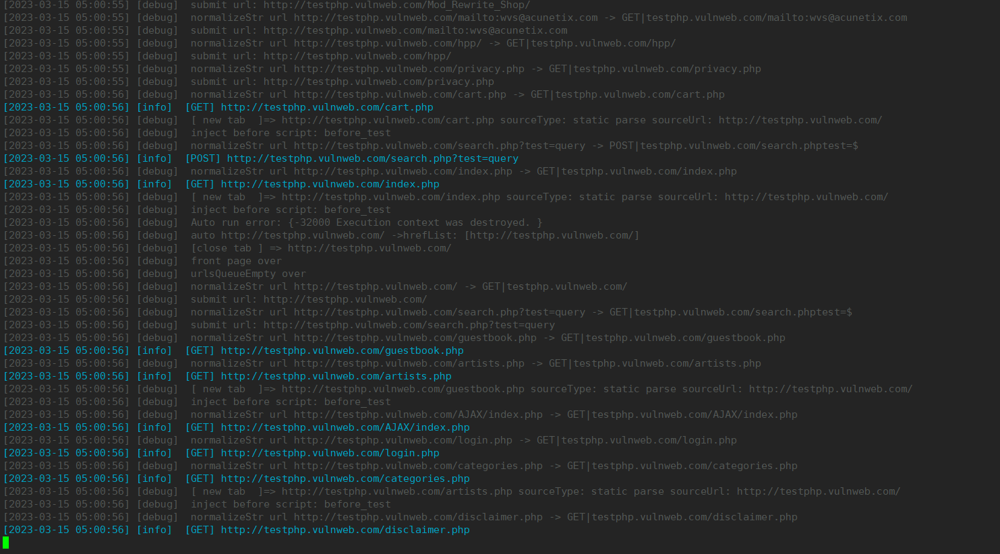
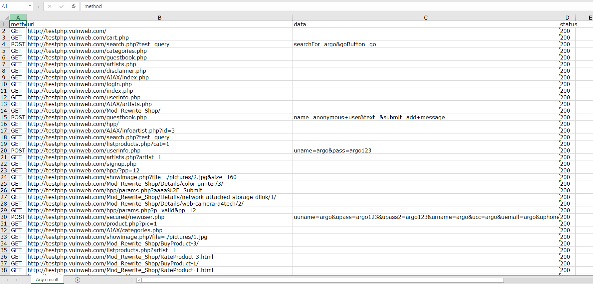

# Argo

[中文 ](./README.md) | English 

The automated general crawler based on go-rod is used to automatically obtain the URL of the website. It must also be implemented based on a headless browser.

## Function
Support is as follows
1. Intelligently trigger page events. For example, if there is a new dom after clicking, it will be processed first
2. Smart login website does not support the case of verification code
3. Support hook full traffic Get all browser traffic output requests and response content through go-rod's HijackRequests
4. Deduplicate the URL, and the final output is stored after deduplication
5. Support multi-format result output txt, json, xlsx, html
6. Support playback of scripts in yaml format, and operations will be performed in sequence
7. Support to open the browser interface and support debug output
8. Support agents


## Install

You can download the latest version directly from here https://github.com/Ciyfly/Argo/releases
No need to manually download chrome, run the program directly and it will automatically download chrome

```shell
./argo -h
NAME:
   argo -  -t http://testphp.vulnweb.com/

USAGE:
   argo [global options] command [command options] [arguments...]

VERSION:
   0.1

AUTHOR:
   Recar <https://github.com/Ciyfly>

COMMANDS:
   help, h  Shows a list of commands or help for one command

GLOBAL OPTIONS:
   --target value, -t value       Specify the entry point for testing
   --targetsfile value, -f value  The specified target file list has each target separated by a new line, just like other tools we have used in the past
   --unheadless, --uh             Is the default interface disabled? Specify 'uh' to enable the interface (default: false)
   --trace                        Whether to display the elements of operation after opening the interface (default: false)
   --slow value                   The default delay time for operating after enabling  (default: 1000)
   --username value, -u value     If logging in, the default username  (default: "argo")
   --password value, -p value     If logging in, the default password (default: "argo123")
   --email value                  If logging in, the default email (default: "argo@recar.com")
   --phone value                  If logging in, the default phone (default: "18888888888")
   --playback value               Support replay like headless YAML scripts
   --testplayback                 If opened, then directly end after executing the specified playback script (default: false)
   --proxy value                  Set up a proxy, for example, 127.0.0.1:3128
   --tabcount value, -c value     The maximum number of tab pages that can be opened (default: 10)
   --tabtimeout value             Set the maximum running time for the tab, and close the tab if it exceeds the limit. The unit is in seconds (default: 180)
   --browsertimeout value         Set the maximum running time for the browser, and close the browser if it exceeds the limit. The unit is in seconds (default: 3600)
   --save value                   The default name for the saved result is 'target' without a file extension. For example, to save as 'test', use the command '--save test'
   --format value                 Result output format separated by commas, multiple formats can be output at one time, and the supported formats include txt, json, xlsx, and html (default: "txt,json")
   --debug                        Do you want to output debug information? (default: false)
   --help, -h                     show help
   --version, -v                  print the version
```

## run

### test http://testphp.vulnweb.com/

```shell
./argo -t http://testphp.vulnweb.com/ --format txt 
```


### test DVWA need to log in

```shell
./argo -t http://192.168.192.128:8080/ -u admin -p password
```


### Use playback to realize dvwa login

```shell
./argo -t http://192.168.192.128:8080/ --playback headless/dvwa.yml  --format txt
```


### Specify the target file through -f, that is, multiple targets

Currently a single target is executed sequentially There is always one browser running
If you need to log in, remember to add the username and password parameters. Currently only a single

```shell
cat targets.txt
http://testphp.vulnweb.com/
http://192.168.192.128:8080/

# run argo
./argo -f targets.txt --format txt
```


### 支持控制事件触发间隔 --slow
The default is 1000ms, that is, 1s event. If input is clicked, it will wait for the interval time before continuing to trigger

```shell
./argo -t http://192.168.192.128:8080/  --slow 
```

### View browser interface --uh

Specify the --uh parameter to run the program and it will display the browser interface that can be used for debugging. Correspondingly, the trace parameter can be enabled to follow the elements triggered by the event

```shell
./argo -t http://192.168.192.128:8080/  --uh
```

### debug 

```shell
./argo -t http://192.168.192.128:8080/  --debug
```

The debug output will output detailed generalization deduplication, parsing url and other information, as shown in the figure below




### Support multiple output formats
For example, the html output results are as follows


The excel table output results are as follows




## explanation

It is the homework of master w8ay knowledge planet, and it is also related to my recent work, so I made this program. It is designed and implemented on the basis of the masters. Of course, if you have any questions, please ask issus or contact me.
At present, there are still many places in the program that can be improved. This program will definitely need time and testing to polish. The next step is to prepare the test program to approach what automation can complete, and the next step is to better support web2.0 websites


## reference

http://blog.fatezero.org/2018/04/09/web-scanner-crawler-02/  
https://pkg.go.dev/github.com/go-rod/go-rod-chinese  
https://chat.openai.com/  

## FAQ 

If there is an anti-virus report when running, as shown in the picture, it says that there is a problem with leakless.exe, you can trust him. This is the source code used by go-rod to control the problems left over from the chrome process. https://github.com/ysmood/leakless Of course, you can also compile and replace it yourself


Argo's compiled program is automatically compiled by github action, of course you can compile it yourself

## statement

Please abide by local laws before using argo, argo is only provided for educational purposes.
